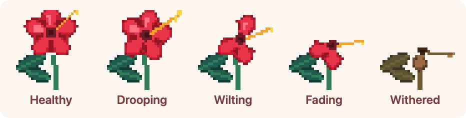

# 🌺 Flower Companion

A tiny desktop companion that lives in the corner of your screen. A pixel-art
hibiscus floats always-on-top and reflects how well you're keeping up with your
tasks. Finish everything and it stays full and red; fall behind and it droops,
sheds petals, and eventually wilts to brown.



---

## Features

- **Always-on-top flower** — a small, frameless, transparent window that sits above everything else.
- **Move it anywhere** — click and drag the flower to reposition it.
- **Resize it** — hover the flower and drag the grip handle in the bottom-right corner.
- **Double-click to open your task list** — a simple checklist you can add to, check off, and clear.
- **The flower reacts to neglect over time.** It doesn't care about percentages —
  it cares whether your unfinished tasks are being left to pile up. Complete
  anything and it perks right back up; ignore your list and it slowly wilts:

  | How long your backlog has sat untended | Flower |
  |---|---|
  | Nothing pending, or you just finished a task | Full, upright, healthy red |
  | ~1 day without progress | Slight droop, all petals |
  | ~2 days | Noticeable droop, a couple of petals fall |
  | ~3 days | Heavy droop, several petals gone |
  | ~4+ days | Fully wilted and brown |

  A large pile of unfinished tasks nudges it one stage further down.

- Your tasks and the flower's position and size stay the same between launches.

---

## Installation

### Option A — Download a prebuilt release (easiest)

1. Go to the [**Releases**](../../releases) page.
2. Download the file for your operating system:
   - **macOS** → `Flower Companion-x.y.z.dmg`
   - **Windows** → `Flower Companion Setup x.y.z.exe`
   - **Linux** → `Flower Companion-x.y.z.AppImage`
3. Open the downloaded file and follow your OS's normal install flow.
   - On macOS, drag the app into your **Applications** folder. The first time you
     open it, right-click the app → **Open** to get past the unsigned-app warning.
   - On Linux, make the AppImage executable (`chmod +x *.AppImage`) and double-click it.

### Option B — Run from source

You'll need [**Node.js**](https://nodejs.org/) (version 18 or newer) installed.

```bash
# 1. Clone the repository
git clone https://github.com/tmedha/flower-companion.git

# 2. Enter the project folder
cd flower-companion

# 3. Install dependencies
npm install

# 4. Run the app
npm start
```

That's it — the flower will appear in the bottom-right corner of your screen.

---

## How to use

| Action | What it does |
|---|---|
| **Drag** the flower | Move it anywhere on screen |
| **Hover + drag** the bottom-right grip | Resize the flower |
| **Double-click** the flower | Open / focus the task list |
| Type a task and press **Enter** (or **+**) | Add a task |
| Click a task or its checkbox | Toggle it complete / incomplete |
| Click the **⏰ snooze** on a task | Reset that task's clock — "I'm working on this," so a long task won't wilt the flower |
| Click **×** on a task | Delete it |

Tasks stay until you delete them, so the same checklist carries over day to day.
The flower tracks how long your unfinished tasks have been sitting: leave them
untended for days and it gradually wilts, but cross any task off and it perks
right back up. Working on something that takes a while? Hit **snooze** on it to
reset its clock so it won't wilt the flower while you're still on it.

---

## Tech stack

- [Electron](https://www.electronjs.org/) — desktop app shell
- HTML, CSS, and vanilla JavaScript
- HTML Canvas — the flower is drawn procedurally as pixel art
- [electron-store](https://github.com/sindresorhus/electron-store) — local data persistence
- [electron-builder](https://www.electron.build/) — packaging & installers

---

## Project structure

```
flower-companion/
├── src/
│   ├── main.js              # Electron main process (windows, IPC, task data)
│   ├── preload.js           # Secure bridge between windows and main
│   ├── flower/              # The always-on-top flower overlay
│   │   ├── index.html
│   │   ├── flower.css
│   │   ├── flower.js        # Canvas rendering, dragging, resizing
│   │   └── flower-art.js    # Procedural pixel-art flower renderer
│   └── panel/               # The task checklist window
│       ├── index.html
│       ├── panel.css
│       └── panel.js
├── scripts/
│   ├── preview-flower.js    # Dev helper: ASCII preview of the flower states
│   ├── asset-gen.html       # Dev helper: draws the icon + states strip
│   └── render-assets.js     # Dev helper: exports those to PNG (npm run assets)
├── assets/
│   ├── icon.png             # App icon
│   └── flower-states.png    # Screenshot used in this README
└── package.json
```

---

## License

MIT
